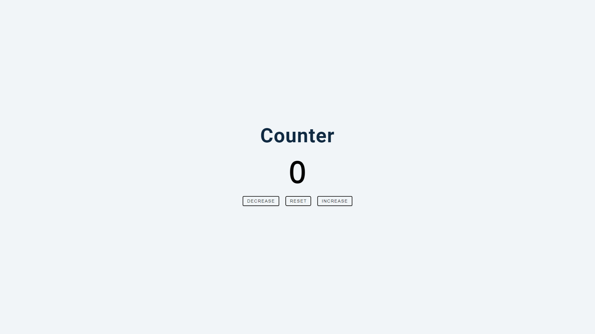
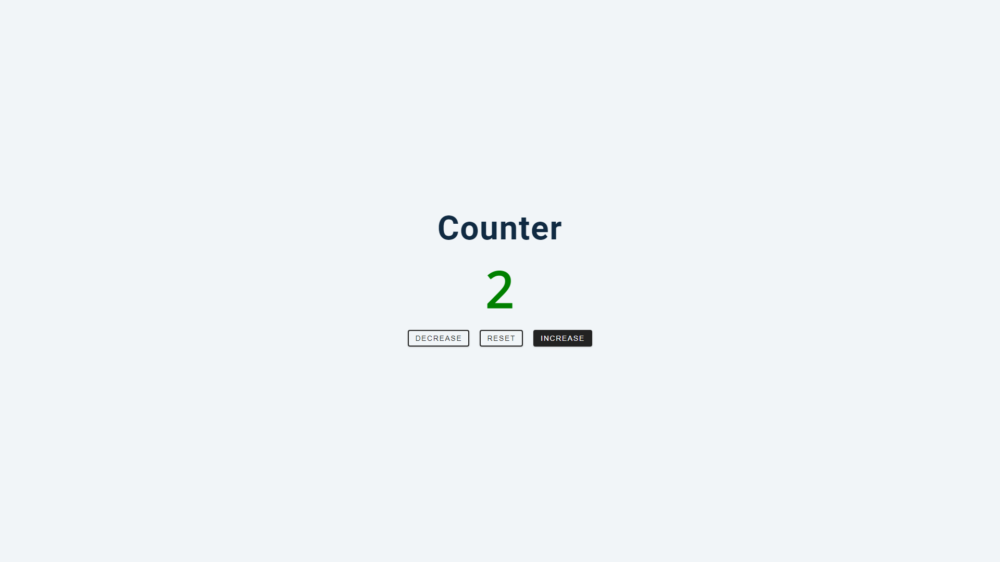
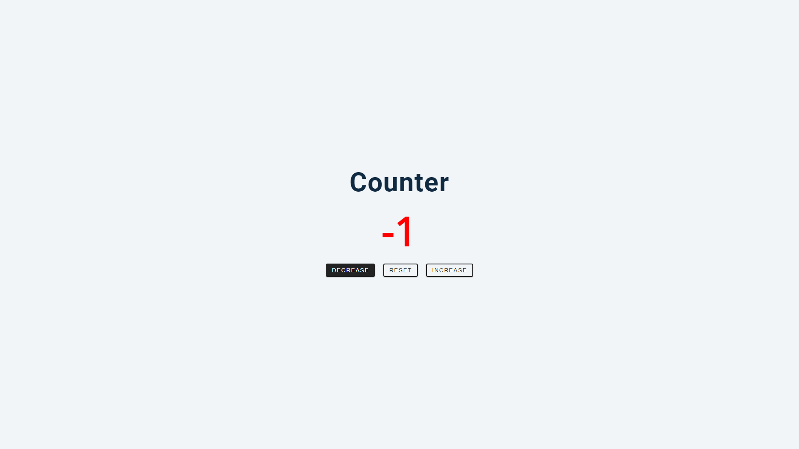
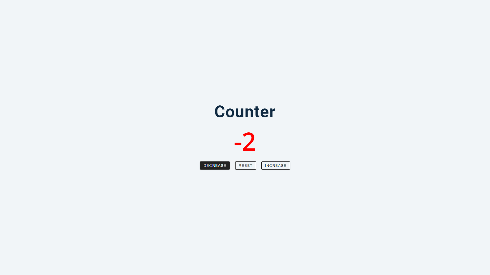
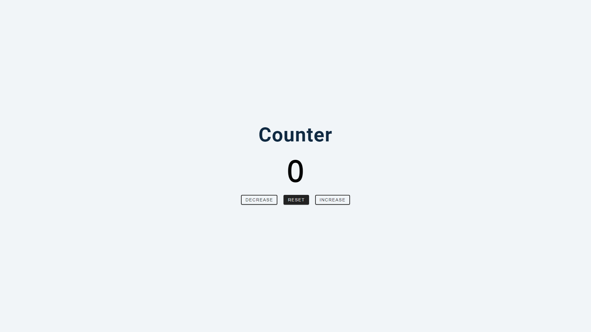

# Counter

This is a Counter project that increases or decreases count by 1 depending on the input that is selected. 
Positive numbers are indicated by green color, negative numbers by red. When counter returns to 0 color returns to black.  
Reset button returns counter to 0 and color to black. 

Increase: 

Decrease: 

Reset: 

